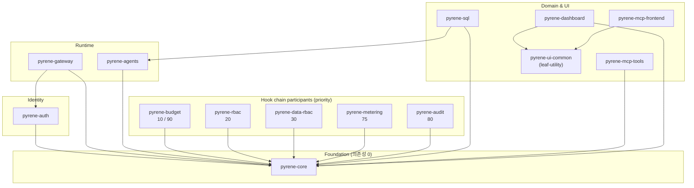
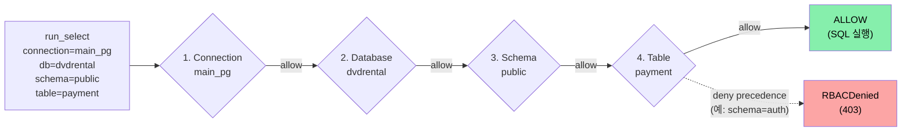

# Pyrene

[](https://github.com/hjp7461/pyrene/actions/workflows/ci.yml)
[](https://github.com/hjp7461/pyrene/actions/workflows/codeql.yml)
[](https://www.python.org/downloads/release/python-3130/)
[](./LICENSE)

**회사 서버에 직접 설치해서 LLM 에이전트(예: 사내 SQL 분석 봇, AI 어시스턴트)를 *권한·예산·감사* 통제 하에 운영하는 도구입니다.**

LLM(ChatGPT 같은 AI)이 사내 데이터베이스에 접근해 자연어 질문에 답하는 시스템을 만들 때, *누가 어떤 데이터를 볼 수 있고 · 얼마나 비용을 쓸 수 있고 · 모든 호출이 어떻게 기록되는지* 를 한 곳에서 관리합니다. Python 3.13 / FastAPI / PostgreSQL 16 위에 `docker compose` 한 줄로 띄울 수 있습니다.

**이런 팀에 필요합니다:**

- *사내 데이터를 외부 SaaS 에 보내고 싶지 않은 팀* — 셀프호스트(자체 서버 설치) 우선 설계, 데이터 외부 유출 0
- *AI 가 어떤 테이블/컬럼을 조회할 수 있는지 정밀하게 통제하려는 팀* — Connection → Database → Schema → Table 4계층 권한이 *기본 기능* (부가 기능 아님)
- *AI 사용 비용을 사용자/팀별로 미리 한도 걸어두고 싶은 팀* — 한도 도달 시 *AI 호출 자체 차단* (사후 알람 아닌 사전 차단)
- *모든 AI 호출이 변조 불가능한 형태로 기록되어야 하는 팀* (규제 산업, 금융 등) — 한 번 기록되면 수정/삭제 불가 + 팀 단위 해시 체인으로 무결성 즉시 검증

**유사 도구와 차별점:** LangSmith / Portkey / Helicone / Langfuse 같은 *LLM 운영·관측 도구* 는 대부분 *클라우드 SaaS 형태*이고 *권한 관리(RBAC)는 부가 기능*입니다. Pyrene 은 (1) **셀프호스트 우선** (회사 서버에 직접 설치), (2) **RBAC 1급 시민** (4계층 권한 + 도구 단위 권한이 *기본*), (3) **fail-closed 예산** (한도 초과 시 호출 자체 차단, 사후 알람 아님), (4) **WORM 감사** (Write Once Read Many — 한 번 쓰이면 수정 불가 + 해시 체인 무결성), (5) **구조화 도구** (LLM 이 raw SQL 작성 금지, `run_select(table=, columns=, ...)` 같은 *구조화된 호출만* 허용 → SQL injection 차단) 가 모두 *기본값* 입니다.

> *기술 한 줄 요약*: Pydantic AI ≥1.93 / PostgreSQL 16 + pgvector 기반. 단일 Hook chain (`BUDGET_PRE → TOOL_RBAC → DATA_RBAC → tool 실행 → COST → AUDIT → BUDGET_POST`) 위에서 결정성·관측성을 잃지 않고 4계층 RBAC + fail-closed 예산 + WORM 감사 + 구조화 도구를 기본값으로 제공.

---

## 핵심 시그널

| 항목 | 값 |
|------|---|
| 워크스페이스 패키지 | **14** (`packages/*`) |
| 자동화 테스트 | **1020** (`pytest --collect-only` · 1017 active + 3 skipped) |
| 타입 안전 | `mypy --strict` 통과 (워크스페이스 전체 289 source files) |
| 마이그레이션 | Alembic **0001 → 0009** (단일 chain) |
| 아키텍처 결정 기록 (ADR) | **22건** (Pydantic AI 통합 · 예산 fail-closed · Postgres 운영정책 · 테스트 격리 · LLM retry boundary · Logfire 검출 경계 · stale-while-error · MCP frontend HTTP-only boundary · Schema RAG Hybrid chunk strategy · ef_search 결정성 정책 · production-policy-mirroring wrapper · Gateway hook wiring scope · 문서 패턴 정준화 · leaf-utility cross-import 예외 · Live Agent spec_id 해석 · LLM tool-arg coercion 경계 · aggregate qualified-column 일관성 · metering summary-cache 미wiring(cost 대시보드 records-only) 등) |
| 시나리오 | Phase 1 (Q1/Q2/Q3/F1/F2) + Phase 2 (A: RBAC 거부 · B: 예산 거부 · C: SQL→파일 합성) |
| 관측성 | Logfire (선택), OTel 호환 span — `LOGFIRE_TOKEN` 설정 시 활성화 (Live Agent 시 매 query footer 에 trace link 노출) |
| Live Agent 시연 | `mcp-frontend /agent` 페이지 — 자연어 → SQL → retry segment → 비용·감사·Logfire link 통합 화면 (PRD-046, mcp-frontend 5번째 페이지) |
| 비용 대시보드 | `mcp-frontend /cost` 페이지 — `/metering/usage/records` records-only 클라이언트 집계 (총비용·요청수·retry 오버헤드 · 일별 추이 · 모델별 · "최근 ≤200건" 정직 라벨 · summary-cache 미wiring 갭 = ADR-029/F-24, PRD-060, mcp-frontend 6번째 페이지) |
| 보안 evals | 42건 (CI: `.github/workflows/security-evals.yml`) |
| 정적 보안 분석 | CodeQL `security-extended` (~100 query · `.github/workflows/codeql.yml` · GitHub Security tab) |
| 코드 커버리지 | **84%** (75% gate · `pytest --cov` · `[tool.coverage]` config) |
| Production recall | **3 variants × 100%** top-3 @ text-embedding-3-small 1024-dim · 218 chunks · 2026-05-14 ([결과](docs/measurements/2026-05-14-recall-baseline.md)) |
| CI 임베딩 fidelity | production OpenAI `text-embedding-3-small @ 1024-dim` *byte-stable replay* (`packages/pyrene-sql/tests/data/embedding_cache.json` · 141 entries · 재생성 `bin/regenerate_embedding_cache.py` · testcontainers 자체 spin up) |
| 데모 결정성 | `.env`만 채우면 `bin/demo-phase1.sh` 4/4 PASS (셸 export 불필요, PRD-019) |

---

## 아키텍처

### Hook chain (Gateway 등록 순서)

```
요청
  │
  ▼
BUDGET_PRE  =10   ← 예산 pre-flight (advisory lock + 한도 검증, fail-closed)
  │
TOOL_RBAC   =20   ← 도구 단위 RBAC (deny precedence)
  │
DATA_RBAC   =30   ← 4계층 데이터 RBAC (Connection/DB/Schema/Table + wildcard)
  │
  ▼  ── 도구 실행 ──
  │
COST        =75   ← 토큰 사용량 × 단가 → usage_records
  │
AUDIT       =80   ← WORM 감사 (per-team hash chain, 위변조 검출)
  │
BUDGET_POST =90   ← 실제 비용 vs 한도 재검증
  │
  ▼
응답
```

40 ~ 70 우선순위 구간은 향후 hook 예약 영역이다.

### 패키지 의존성 그래프



모든 패키지가 `pyrene-core` 만 의존하거나, `core` + `auth` + `gateway` 까지로 한정된다 — cross-domain import 금지가 *그래프적으로 가시화된 invariant* (아래 §"14 패키지" 의 의존 규칙 참조). 단, leaf-utility (`pyrene-ui-common` — 도메인 의존 0) 는 예외로 `pyrene-mcp-frontend` · `pyrene-dashboard` 가 import 허용 (F-20 / ADR-025).

### 4계층 데이터 RBAC (F-08)



4계층 모두 ALLOW 시에만 도구가 실행된다. 어느 계층이든 명시적 deny 가 있으면 즉시 차단 (deny precedence) — 시나리오 A 의 `payment` 테이블 SELECT 가 정확히 이 경로를 따른다.

### 14 패키지

| 패키지 | 역할 |
|--------|------|
| `pyrene-core` | `StrictBaseModel` · errors · audit Protocol · Logfire 설정 (의존성 0) |
| `pyrene-sql` | Phase 1 SQL analyst — 구조화 도구 (`run_select` / `run_join` / `run_aggregate`) · 스키마 RAG · 외부 retry · evals |
| `pyrene-auth` | User / Team / Role / UserTeamRole · 비밀번호 hashing (argon2) · JWT |
| `pyrene-agents` | AgentSpec registry · agent builder · ToolRegistry |
| `pyrene-gateway` | Hook chain runtime · AuditSink Protocol · MCP gateway |
| `pyrene-rbac` | 도구 단위 RBAC (Permission · PermissionResolver · deny precedence) |
| `pyrene-data-rbac` | 4계층 데이터 RBAC (F-08) — Connection/DB/Schema/Table + wildcard |
| `pyrene-metering` | UsageRecord · 모델별 단가 · 토큰 → 비용 환산 |
| `pyrene-audit` | WORM 트리거 + per-team hash chain · 무결성 검증 |
| `pyrene-budget` | Limit (일/월) · advisory lock · pre/post hook fail-closed (ADR-010) |
| `pyrene-mcp-tools` | Filesystem (O_NOFOLLOW + sandbox root) · GitHub MCP 래퍼 |
| `pyrene-dashboard` | Streamlit 어드민 (RBAC matrix · 거부 카운터 · 예산 heatmap · 비용 · 감사) |
| `pyrene-mcp-frontend` | Streamlit MCP 도구 invocation UI (admin/analyst · jsonschema → form · gateway HTTP-only — ADR-019 / F-15) |
| `pyrene-ui-common` | 공유 leaf-utility (HTTP client · friendly_error · fetch_or_stale UX — httpx/streamlit 만 의존, 도메인 0 · ADR-025 / F-20) |

**의존 규칙**: `pyrene-core`만 다른 패키지 의존 0. 신규 도메인 패키지는 `pyrene-core` + `pyrene-auth` + `pyrene-gateway`까지만 의존 허용 (cross-import 금지). 단 *leaf-utility* (`pyrene-ui-common` — 도메인 의존 0) 는 예외로 frontend 가 import 허용 (ADR-025 / F-20 — hook chain 미포함이라 우회 불가).

---

## 빠른 시작

### 사전 요구사항

- **Docker** + **Docker Compose v2** (Postgres 16 + pgvector 이미지를 받기 위해)
- **Python 3.13+** 와 **[uv](https://docs.astral.sh/uv/)** (로컬 개발/테스트 시)
- (선택) **`ANTHROPIC_API_KEY`** — Phase 1 데모에서 실 LLM 호출을 하려면 필요
- (선택) **`OPENAI_API_KEY`** — 스키마 RAG 인덱싱 (`pyrene-sql index-schema`) 시 필요
- (선택) **`LOGFIRE_TOKEN`** — 분산 trace 가시화

### 1. 환경 변수 준비

```bash
cp .env.example .env
# .env 를 열어 ANTHROPIC_API_KEY, OPENAI_API_KEY, LOGFIRE_TOKEN(선택), JWT_SECRET 등을 채운다.
```

> `JWT_SECRET`은 로컬 기본값(`pyrene-dev-secret-...`)이 들어있지만, 외부에 노출되는 환경에서는 **반드시 32바이트 이상의 고엔트로피 값으로 재정의**해야 한다.

### 2. Docker로 풀스택 기동

가장 빠르게 모든 컴포넌트를 띄우는 방법:

```bash
# 기본: postgres + Streamlit 대시보드만 (가벼움)
docker compose up -d

# 풀스택: + 통합 FastAPI (auth/agents/gateway/rbac/data-rbac/metering/audit/budget) + echo MCP
docker compose --profile api up -d
```

기동 후 접속:

| 서비스 | URL | 비고 |
|--------|-----|------|
| Streamlit 대시보드 | http://localhost:8501 | RBAC 매트릭스 / 거부 카운터 / 예산 heatmap / 비용 / 감사 |
| 통합 API (`--profile api`) | http://localhost:8000 | `/health`, `/auth/*`, `/agents/*`, `/servers/*`, `/permissions/*`, … |
| Postgres | `localhost:5433` | user=`pyrene`, db=`dvdrental` (DVD Rental 샘플 + 마이그레이션 자동 적용) |
| echo-mcp (`--profile api`) | http://localhost:9000 | gateway 통합 테스트용 stub MCP |

Postgres 컨테이너는 기동 시 `deploy/postgres/initdb/`의 시드 스크립트로 **DVD Rental 샘플 + read-only 역할 (`pyrene_readonly`)** 까지 자동 설정한다 (ADR-013 dual-role).

### 3. 로컬 개발 (uv workspace)

컨테이너 없이 워크스페이스에서 직접 작업할 때:

```bash
uv sync --all-packages               # 의존성 설치 (14 패키지 + dev group)
uv run alembic upgrade head          # 마이그레이션 적용 (Postgres가 5433에 떠 있다고 가정)
uv run pytest packages -q            # 전체 테스트 (1020개)
uv run mypy --strict packages        # 타입 체크
uv run ruff check && uv run ruff format --check    # 린트/포맷
```

### 4. 데모 실행

`bin/demo.sh`는 모든 시나리오의 단일 진입점이다.

```bash
# 전체 (Phase 1 → A → B → C → 대시보드 URL, 약 5분 분량)
bin/demo.sh all

# 부분
bin/demo.sh phase1       # Phase 1: Q1 / Q2 / Q3 (실 LLM 호출, ANTHROPIC_API_KEY 필요)
bin/demo.sh scenario-a   # RBAC 거부 + WORM 감사
bin/demo.sh scenario-b   # 예산 fail-closed (BUDGET_PRE=10 hook)
bin/demo.sh scenario-c   # SQL → 마크다운 → Filesystem MCP 합성
bin/demo.sh dashboard    # Streamlit URL 안내
```

유용한 환경 변수:

| 변수 | 효과 |
|------|------|
| `PYRENE_DEMO_SKIP_LLM=1` | Phase 1 LLM 호출 스킵 (스택 헬스 체크만) — CI 친화 |
| `PYRENE_DEMO_VERBOSE=1` | `pyrene-sql ask` 출력을 raw JSON으로 |
| `PYRENE_DEMO_NO_COMPOSE=1` | `docker compose up` 스킵 (이미 떠 있다고 가정) |

> **참고**: Phase 1 (Q1/Q2/Q3)은 실제 Pydantic AI 에이전트를 호출한다. 시나리오 A/B/C는 hook chain의 *순서와 결과를 관측 가능한 형태로 narrate* 하는 스크립트다 — 동일한 흐름의 풀 HTTP roundtrip은 `pytest packages/pyrene-gateway/tests/integration -m integration`이 검증한다.

### 5. 첫 어드민 계정 생성 (선택)

대시보드/API를 실제로 로그인해서 둘러보고 싶다면:

```bash
# .env 의 ADMIN_EMAIL / ADMIN_PASSWORD 가 사용된다 (또는 플래그)
uv run pyrene-auth init-admin
# 또는: uv run pyrene-auth init-admin --email me@example.com --password '...'
```

이 커맨드는 idempotent — 같은 이메일로 다시 호출하면 비밀번호만 갱신된다.

---

## CLI 요약

| 커맨드 | 패키지 | 설명 |
|--------|--------|------|
| `pyrene-sql ask <질문>` | `pyrene-sql` | DVD Rental에 자연어 질의 → 구조화 도구 호출 → `AnalystResponse` |
| `pyrene-sql index-schema` | `pyrene-sql` | pgvector에 스키마 카드 인덱싱 (RAG, F-05) |
| `pyrene-auth init-admin` | `pyrene-auth` | 첫 admin (team=default, role=admin) 부트스트랩 |
| `pyrene-agents …` | `pyrene-agents` | AgentSpec CRUD / run (subcommand 다수) |
| `pyrene-dashboard` | `pyrene-dashboard` | Streamlit 진입점 (compose가 이미 띄움) |

---

## 테스트 / 검증

```bash
uv run pytest packages -q                                        # 전체 (1020건 — 1017 active + 3 live skip)
uv run pytest packages/pyrene-sql/tests/evals -q                 # Pydantic Evals 데이터셋
uv run pytest packages -m integration -q                         # testcontainers Postgres 통합
uv run pytest packages/pyrene-budget/tests/evals -q              # 보안 evals — 예산 우회 / advisory lock
```

CI 파이프라인 (`.github/workflows/`):

- `ci.yml` — 린트 (ruff) + 타입 (mypy --strict) + 단위/통합 테스트
- `evals.yml` — Pydantic Evals 회귀 (모델 안전성 / 정확도)
- `security-evals.yml` — RBAC 우회 / 예산 우회 / WORM 무결성 42건

---

## 시나리오 (Phase 2)

| 시나리오 | 핵심 검증 |
|----------|----------|
| **A. RBAC 거부 + 감사** | `analyst` 는 `public.payment.amount` SELECT 통과, `viewer`는 403 `RBACDenied` — 동일 요청이 WORM 감사 1행으로 기록되고 per-team hash chain의 `prev_hash` 가 일치 (위변조 검출 가능) |
| **B. 예산 fail-closed** | `viewer` 의 일일 한도 \$1.00 도달 직후 다음 요청이 `BUDGET_PRE=10` hook에서 402 `BudgetExhausted` 로 차단 — **도구 실행 0, 비용 발생 0** (ADR-010) |
| **C. 다중 도구 합성** | `analyst` 가 "카테고리별 매출 Top 5 → /tmp/report.md" 요청 → Postgres MCP `run_aggregate` → markdown 생성 → `FilesystemMcpTool.write` (`O_NOFOLLOW` + sandbox root) — 단일 trace에 2개의 tool span, cost/audit/RBAC 전체 커버 |

---

## 고정 결정 (요약, 23건)

| # | 결정 |
|---|------|
| F-01 | 모노레포 + uv workspace |
| F-02 | 도구는 raw SQL이 아닌 **구조화된 형태** (`run_select(table=, columns=, …)`) — RBAC을 string match로 처리 |
| F-03 | **코드 가드 + DB 가드 이중 방어** (read-only role) |
| F-04 | Self-correction 최대 **3회 재시도** (빈 결과/타임아웃/권한 거부는 재시도 X) |
| F-05 | 스키마 인지: **pgvector RAG** (전체 스키마 주입 X) |
| F-06 | 출력: SQL + 자연어 설명 + 결과 + 분석 + confidence |
| F-07 | 데모 DB: PostgreSQL DVD Rental |
| F-08 | RBAC 4계층: **Connection → Database → Schema → Table** (행/컬럼 마스킹 제외) |
| F-09 | 메트링 1순위: **비용** (토큰/모델별 \$, 예산, 알람) |
| F-10 | 배포: **docker-compose만** (k8s/AWS 미사용) |
| F-11 | UI 최소화: **Streamlit** (React 미사용) |
| F-12 | 관측성: **Logfire 필수 (선택)** + OTel 호환 |
| F-13 | 면접 시그널 3가지: **ADR · Pydantic Evals · 공개 Logfire trace** |
| F-14 | **LLM tool-call retry boundary 는 wrap-then-classify** — `pydantic_ai.UnexpectedModelBehavior` 를 `ModelToolValidationError(RetryableError)` 로 wrap 해 외부 `RetryWrapper` 가 단일 책임으로 retry 담당 (ADR-016) |
| F-15 | **MCP frontend ↔ gateway = HTTP-only boundary** — `pyrene-mcp-frontend` 는 gateway 를 HTTP API 로만 호출. Python import 금지 → hook chain (RBAC/audit/budget) 단일 진입점 보장 + dashboard 패턴 일관 (ADR-019) |
| F-16 | **Schema RAG = Hybrid chunk strategy** — `pyrene_schema_embeddings` 에 *table chunk* 1 + *column chunks* N per table 동시 저장 (`chunk_type ∈ {'table','column'}` + `column_name` sentinel). retriever 가 `k_table=2 + k_column=5` 별도 SELECT → distance ASC merge. PRD-002 L-03 escalation 의 본격 후속 (ADR-020) |
| F-17 | **HNSW `ef_search=200` 정책 본질 = CI 결정성 회복 layer (production 무관)** — production 측정 (3 variants 모두 100%) + CI cache replay 도입으로 *원래의 flaky margin 보호* 가 *artificial worst-case 보호* 였음이 입증. cache replay (*입력 layer*) + ef_search=200 + ORDER BY tie-break (*retrieval layer*) 의 *두 layer 결정성*. 메커니즘 무변경, purpose 재정의 (ADR-021) |
| F-18 | **Demo endpoint = 기본 endpoint 와 동일 실행 경로 (정책 우회 코드 분기 0)** — `/run-with-trace` 가 `/run` 과 동일한 `run_with_retry` 경로 + observability augment만. 부분 분기 미허용. "mirror" = 코드 path 동일성 (둘 다 hook chain 미경유 — production wiring 은 의도적 out-of-scope) (ADR-022 · Amended ADR-023) |
| F-20 | **leaf-utility 패키지는 cross-import 금지의 예외** — `pyrene-ui-common` (도메인 의존 0, httpx/streamlit만) 은 hook chain 미포함이라 import 해도 단일 진입점 우회 불가 → `pyrene-mcp-frontend` · `pyrene-dashboard` 가 import 허용 (ADR-025) |
| F-21 | **Live Agent spec_id 해석은 frontend 책임 (name→UUID)** — `agent_client._resolve_spec_uuid` 가 이름→UUID 해석, 백엔드 `/agents/{spec_id}/run` 의 `spec_id: UUID` contract 불변. 미등록 시 actionable 한국어 에러 (ADR-026) |
| F-22 | **LLM tool-arg JSON-stringification 은 tool 경계에서 coerce** — 모델이 비-스칼라 인자를 JSON 문자열로 직렬화할 때 `model_validator(mode="before")` 가 `json.loads` 복원. retry 정책 무변경 (ADR-016 intact · ADR-027) |
| F-23 | **`AggregationSpec.column` 은 `group_by` 와 동일하게 join-aware** — JOIN aggregate 에서 `table.column` qualified 형식 허용. 내부 contract 일관성 (`_check_column_ref` 재사용, ADR-028) |
| F-24 | **metering summary-cache 가 deploy/api 미wiring → cost 대시보드 records-only** — `set_summary_cache()` 호출지점 0, production wiring 은 의도적 out-of-scope (Phase 4 후보). 갭을 ADR 로 선제 형식화 (ADR-029) |

새 결정은 ADR로 기록한 뒤에만 이 표를 갱신한다.

---

## 의도적 미구현 (v2 이월)

- **행/컬럼 마스킹** — SQL 파서 직접 구현은 시간 예산 함정 (ADR-007 v2 deferral)
- **SSO / OIDC** — JWT만 제공 (외곽에서 Reverse proxy로 연동하는 것을 가정)
- **k8s / AWS 배포 manifest** — docker-compose 단일 진입점 (F-10)
- **React 풀스택 UI** — Streamlit으로 충분 (F-11). 이 포트폴리오의 정체성이 아님

---

## 라이선스

[MIT](./LICENSE)
